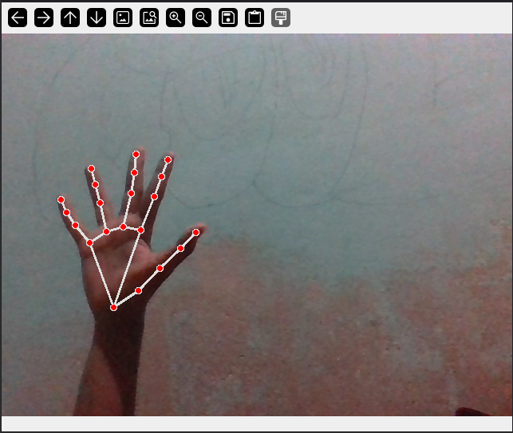
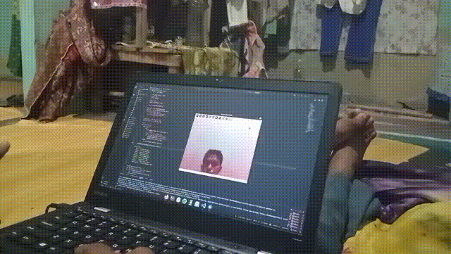
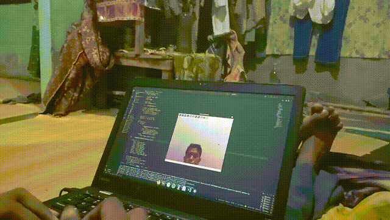
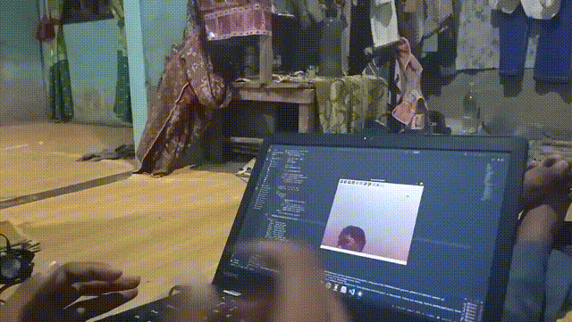
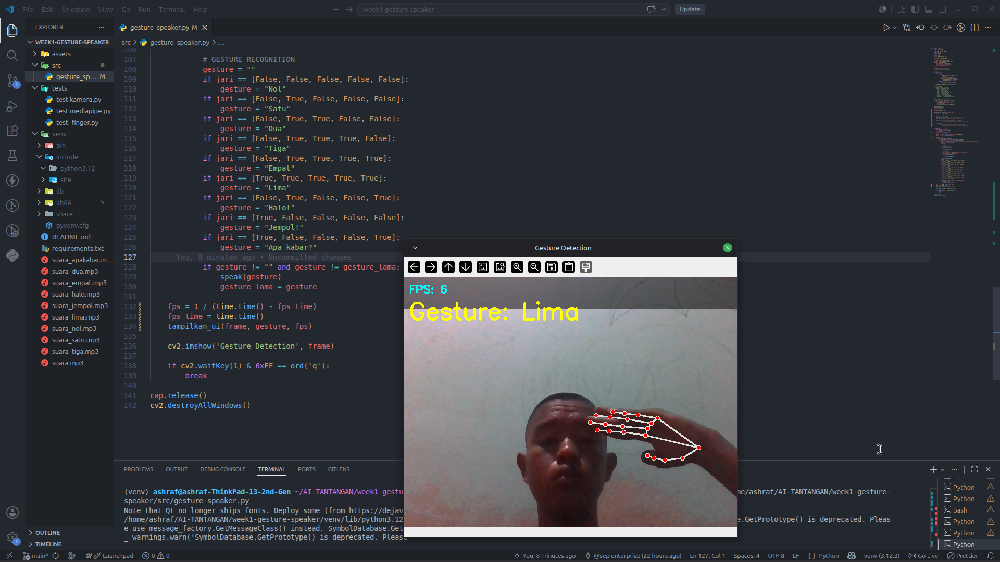

# 🖐️ HAND AI GESTURE SPEAKER

> Sistem pengenal gesture tangan berbasis AI yang dapat mengeluarkan suara otomatis.
> Real-time hand gesture recognition powered by MediaPipe & OpenCV.


## 🎬 Demo

### Gesture Halo


### Gesture Jempol


### Gesture Apa Kabar


## Day 5 UI + FPS


## ✨ Fitur
- 🖐️ Deteksi tangan secara realtime
- 🔴 21 titik landmark tangan
- 🔊 Output suara otomatis berdasarkan gesture
- ⚡ Dibangun dengan Python, OpenCV, MediaPipe

## 🛠️ Teknologi
| Library | Versi | Fungsi |
|---------|-------|--------|
| Python | 3.12 | Bahasa pemrograman |
| OpenCV | 4.x | Kamera & pemrosesan gambar |
| MediaPipe | 0.10.13 | Deteksi tangan AI |
| gTTS | latest | Text to Speech |

## 🚀 Cara Menjalankan
```bash
# Clone repository
git clone https://github.com/Asepenterprise/AI-TANTANGAN.git

# Masuk ke folder
cd AI-TANTANGAN/week1-gesture-speaker

# Aktifkan virtual environment
source venv/bin/activate

# Install dependencies
pip install -r requirements.txt

# Jalankan program
python src/gesture_speaker.py
```

## 🎯 Gesture yang Didukung
| Gesture | Suara |
|---------|-------|
| ✋ Telapak terbuka | "Halo!" |
| ✌️ Dua jari | "Apa kabar?" |
| 👌 OK | "Selamat pagi!" |

## 👨‍💻 Developer
**Asepenterprise** — 30 Days AI Inventor Challenge
> Day 1-7 | Week 1 Project
