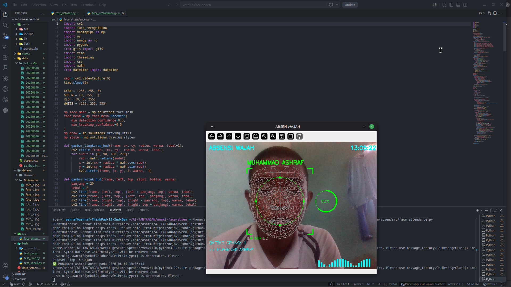

# 👤 AI FACE ATTENDANCE SYSTEM
> Sistem absensi wajah berbasis AI yang mengenali wajah secara realtime
> AI-powered face attendance system using face_recognition & OpenCV



## ✨ Fitur
- 👤 Deteksi & pengenalan wajah realtime
- 📊 Confidence score — seberapa yakin AI mengenali wajah
- 📋 Catat absensi otomatis ke CSV
- 📸 Foto bukti absensi tersimpan otomatis
- 🔊 Suara sambutan "Selamat datang, [Nama]!"
- 📺 Daftar hadir live di layar
- ⏰ Waktu realtime di layar
- 🛡️ Anti double absen

## 🛠️ Teknologi
| Library | Fungsi |
|---------|--------|
| Python 3.12 | Bahasa pemrograman |
| OpenCV | Kamera & pemrosesan gambar |
| face_recognition | Pengenalan wajah AI |
| gTTS | Text to Speech |
| pygame | Memutar suara |
| CSV | Penyimpanan data absensi |

## 🚀 Cara Menjalankan
```bash
cd week2-face-absen
source ../week1-gesture-speaker/venv/bin/activate
python src/face_attendance.py
```

## 📁 Struktur Folder

## 👨‍💻 Developer
**Muhammad Ashraf** — 30 Days AI Inventor Challenge
> Day 8-12 | Week 2 Project
